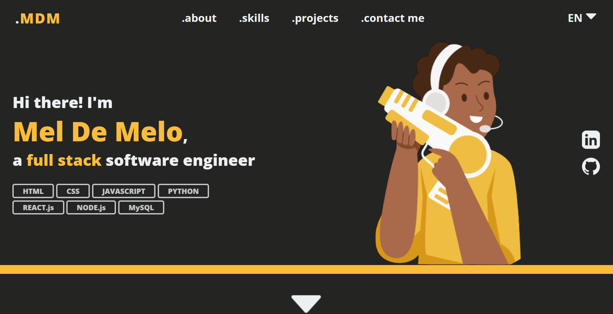

    <h1>Portafolio</h1>
    
<a href='./README.md' style='cursor: pointer'>ENG - README</a> || <a href='./README.pt-br.md'style='cursor: pointer'>PT - README</a>

    <h2>PREVIEW</h2>
    </img>
    <h1><a style='text-decoration: none; text-transform: uppercase' href='https://meldemelo-portfolio.vercel.app/' target='_blank'>See live 🚀</a></h1>
    

    <h2>Desarrollado con</h2>
    
    
   
   
   
   
   

    <h2>Funcionalidades:</h2>
    <ul style="text-align: left; font-size: 16px">
        <li>100% responsivo en todos los tamaños de pantalla, garantizando una experiencia de usuario perfecta. Esto implica ocultar selectivamente ciertos elementos en pantallas más pequeñas.</li> 
        <li> Scroll animation para crear una experiencia visual más atractiva. A medida que los visitantes scroll la página, los elementos crean vida con animaciones suaves.</li> 
        <li> Encabezado fijo que permanece en la parte superior de la página mientras te desplazas. Esto facilita la navegación y el acceso a las secciones importantes, sin necesidad de volver a desplazarse hacia arriba.</li> 
        <li> La sección 'Contact Me' incluye un formulario de contacto con tratamiento avanzado de errores. Si un usuario intenta enviar el formulario con campos vacíos o inválidos, recibirán notificaciones que les guiarán para corregir los errores antes de enviar.</li> 
        <li> Los visitantes que se ponen en contacto recibirán un correo electrónico de confirmación después de un envío exitoso del formulario.</li>  
        <li> Actualmente estoy trabajando en la tradución para portugués y español.</li>              
    </ul>
    

    <h2>Dev's thoughts</h2>
    
¡Finalmente! Después de más de veinte horas de desarrollo y algunos extras de design, puedo invitarte a explorar mi portafolio. Si estás interesado en colaboraciones o tienes sugerencias, ¡no dudes en ponerte en contacto! Muchas gracias a las bibliotecas (<a href='https://www.emailjs.com/'>EmailJS</a>, <a href='https://fkhadra.github.io/react-toastify/introduction'>Toastify</a>, <a href='https://github.com/michalsnik/aos'>react-aos</a>) que han facilitado significativamente el proceso de desarrollo. También quiero dar créditos a <a href='https://storyset.com/'>Storyset</a> por las ilustraciones. Espero sinceramente que este portafolio pueda dar una idea de quién soy, tanto como persona como profesional.

